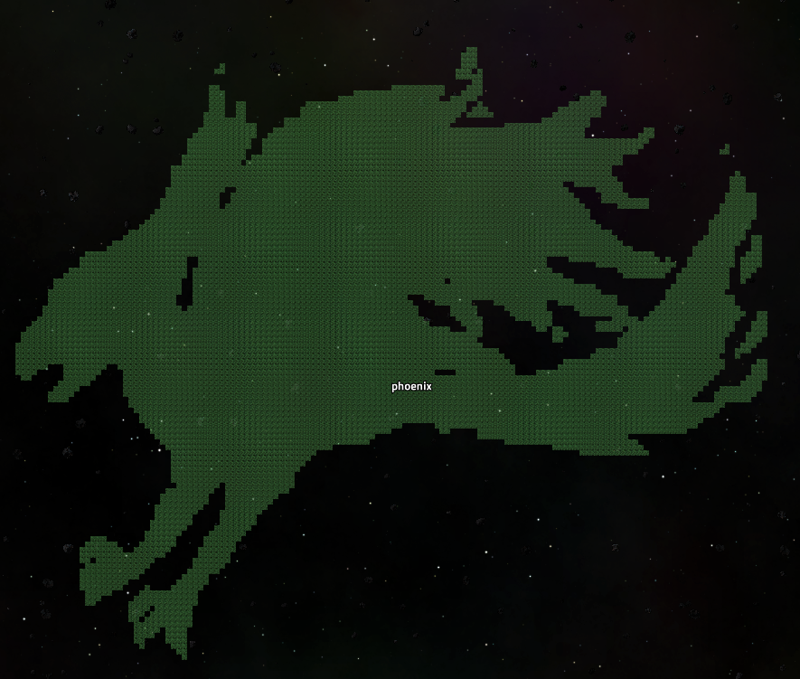

# Image To Space Platform

This script can transfer an image into a blueprint of space platform for the Factorio:SpaceAge.

### Example of the finished photo:

Original image:


Result in the game:




## Usage

```bash
python main.py <file_path> [options]
```

### Arguments:
- `File Path` (required): The path to the image you want to process.

#### Optional Flags
 - `-W, --width` (optional): The desired width of the image after conversion. If only this parameter is provided, the height will be automatically calculated to maintain the aspect ratio of the original image.

 - `-H, --height` (optional): The desired height of the image after conversion. If only this parameter is provided, the width will be automatically calculated to maintain the aspect ratio of the original image.

 - `-I, --invert` (optional): If specified, this option will invert the colors of the image.

 - `-T, --threshold` (optional): The threshold value for grayscale conversion, an integer between 0 and 255 (inclusive). The default value is 128.

### Examples
- Convert an image to grayscale with a custom threshold and invert the colors:
```bash
python main.py path_to_image.jpg -T 200 -I
```

- Resize the image to a width of 300px, with the height automatically adjusted to maintain the aspect ratio:
```bash
python main.py path_to_image.png -W 300
```

Convert the image with a custom threshold but maintain the original size:
```bash
python main.py path_to_image.png -T 180
```